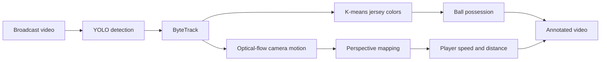

# Football Video Analysis

A learning project that combines object detection, multi-object tracking, color clustering, optical flow, and perspective transformation to analyze broadcast football video.

> **Project status:** this repository follows Abdullah Tarek's public football-analysis tutorial and repository. It is presented as a tutorial-derived implementation—not as an original research contribution. Independent extensions and a reproducible detector benchmark are still to be added.

## Attribution

The architecture and much of the implementation follow:

- [Build an AI/ML Football Analysis System with YOLO, OpenCV, and Python](https://www.youtube.com/watch?v=neBZ6huolkg), by Abdullah Tarek
- [abdullahtarek/football_analysis](https://github.com/abdullahtarek/football_analysis)

The upstream repository does not currently declare a license. Anyone planning to reuse or redistribute its code should first obtain or verify the necessary permission. This repository should eventually replace tutorial-derived sections with independently implemented and documented components.

## Pipeline



The current code covers:

- player, referee, goalkeeper, and ball detection;
- player tracking with ByteTrack;
- ball-position interpolation;
- jersey-color clustering for team assignment;
- ball-to-player proximity assignment;
- camera-motion estimation with Lucas–Kanade optical flow;
- dataset-specific perspective transformation; and
- speed, distance, and possession overlays.

## Current limitations

- `models/best.pt` is not included, so inference does not run immediately after cloning.
- The original training dataset, split, configuration, logs, and model weights are not documented here.
- There is no published baseline-versus-fine-tuned evaluation. No accuracy-improvement claim should be inferred from this repository.
- The perspective coordinates and pitch dimensions are calibrated for one sample video rather than estimated automatically.
- The repository does not yet include a complete top-level pipeline entry point; `yolo_inference.py` only demonstrates detector inference.
- Cached pickle files are local artifacts and must never be loaded from an untrusted source.

## Setup

```bash
python -m venv .venv
source .venv/bin/activate
pip install -r requirements.txt
```

Place a compatible Ultralytics detector at `models/best.pt`, then run the current inference smoke test:

```bash
python yolo_inference.py
```

The sample path in `yolo_inference.py` is `input_videos/08fd33_4.mp4`.

## Tests

```bash
pip install -r requirements-dev.txt
pytest -q
```

The initial tests cover bounding-box geometry and cached camera-motion behavior. More tests are needed for tracking, team assignment, perspective calibration, and the full pipeline.

## Planned independent work

To turn this into meaningful portfolio evidence:

1. Select and cite a football-detection dataset with a documented license.
2. Define train, validation, and held-out video splits that prevent adjacent-frame leakage.
3. Reproduce a named baseline with saved configuration and logs.
4. Add one independent model or tracking extension.
5. Report detection metrics such as mAP@0.5 and mAP@0.5:0.95, plus a tracking metric such as HOTA or IDF1.
6. Publish failure cases for the ball, occlusion, camera cuts, and team-color ambiguity.
7. Replace hard-coded perspective coordinates with a documented calibration interface.

## Example output


## Author

[Asylkhan Kali](https://github.com/AsylkhanKali) — Computer Vision & Embodied AI researcher at NYU Abu Dhabi.
